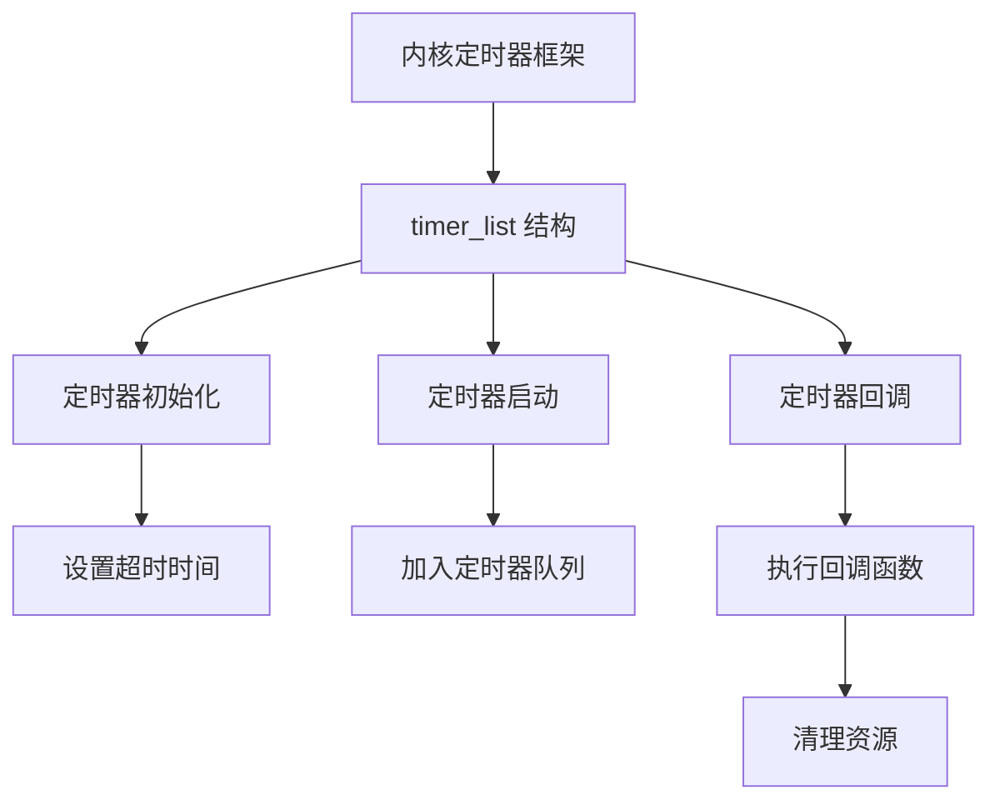

# 内核定时器 - 架构图

```mermaid
graph TD
    A["内核定时器框架"] --> B["timer_list 结构"]
    B --> C["定时器初始化"]
    B --> D["定时器启动"]
    B --> E["定时器回调"]
    C --> F["设置超时时间"]
    D --> G["加入定时器队列"]
    E --> H["执行回调函数"]
    H --> I["清理资源"]
```
