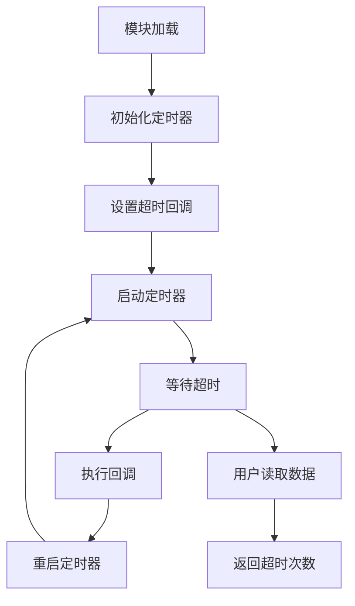

# 内核定时器 - 流程图

```mermaid
graph TD
    A["模块加载"] --> B["初始化定时器"]
    B --> C["设置超时回调"]
    C --> D["启动定时器"]
    D --> E["等待超时"]
    E --> F["执行回调"]
    F --> G["重启定时器"]
    G --> D
    E --> H["用户读取数据"]
    H --> I["返回超时次数"]
```
