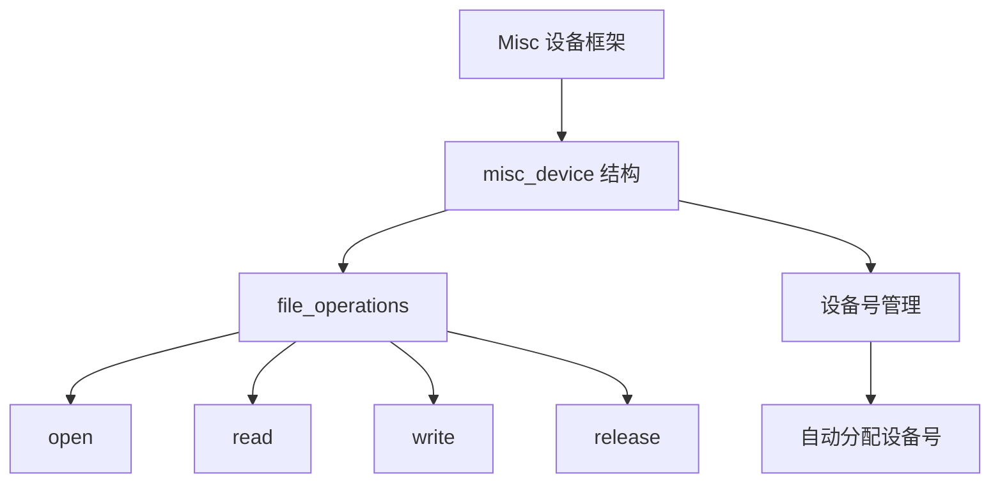

# Misc 设备驱动 - 架构图

```mermaid
graph TD
    A["Misc 设备框架"] --> B["misc_device 结构"]
    B --> C["file_operations"]
    B --> D["设备号管理"]
    C --> E["open"]
    C --> F["read"]
    C --> G["write"]
    C --> H["release"]
    D --> I["自动分配设备号"]
```
