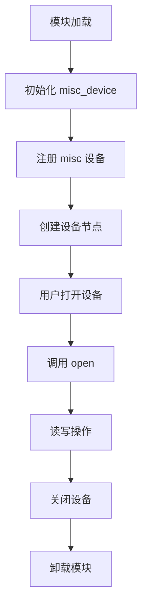

# Misc 设备驱动 - 流程图

```mermaid
graph TD
    A["模块加载"] --> B["初始化 misc_device"]
    B --> C["注册 misc 设备"]
    C --> D["创建设备节点"]
    D --> E["用户打开设备"]
    E --> F["调用 open"]
    F --> G["读写操作"]
    G --> H["关闭设备"]
    H --> I["卸载模块"]
```
