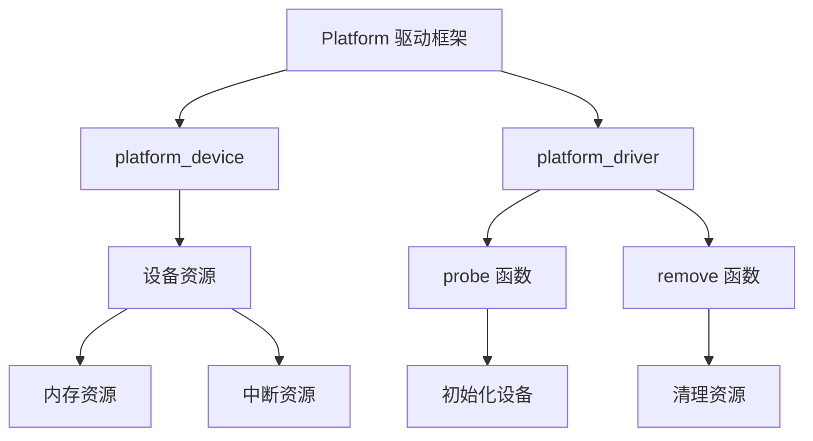

# Platform 驱动框架 - 架构图

```mermaid
graph TD
    A["Platform 驱动框架"] --> B["platform_device"]
    A --> C["platform_driver"]
    B --> D["设备资源"]
    C --> E["probe 函数"]
    C --> F["remove 函数"]
    D --> G["内存资源"]
    D --> H["中断资源"]
    E --> I["初始化设备"]
    F --> J["清理资源"]
```
