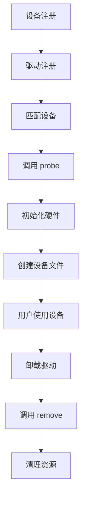

# Platform 驱动框架 - 流程图

```mermaid
graph TD
    A["设备注册"] --> B["驱动注册"]
    B --> C["匹配设备"]
    C --> D["调用 probe"]
    D --> E["初始化硬件"]
    E --> F["创建设备文件"]
    F --> G["用户使用设备"]
    G --> H["卸载驱动"]
    H --> I["调用 remove"]
    I --> J["清理资源"]
```
