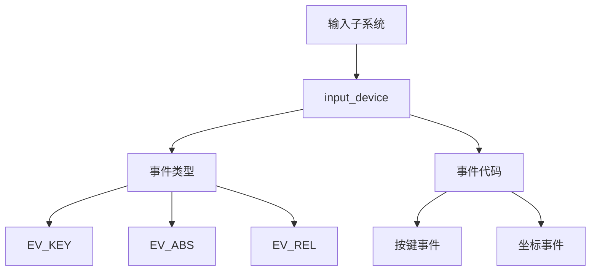

# 输入子系统 - 架构图

```mermaid
graph TD
    A["输入子系统"] --> B["input_device"]
    B --> C["事件类型"]
    B --> D["事件代码"]
    C --> E["EV_KEY"]
    C --> F["EV_ABS"]
    C --> G["EV_REL"]
    D --> H["按键事件"]
    D --> I["坐标事件"]
```
