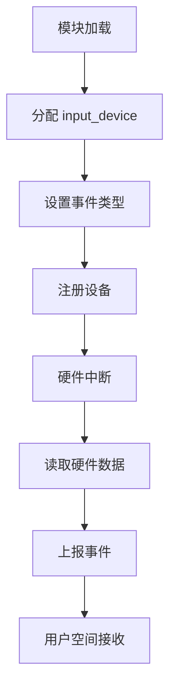

# 输入子系统 - 流程图

```mermaid
graph TD
    A["模块加载"] --> B["分配 input_device"]
    B --> C["设置事件类型"]
    C --> D["注册设备"]
    D --> E["硬件中断"]
    E --> F["读取硬件数据"]
    F --> G["上报事件"]
    G --> H["用户空间接收"]
```
