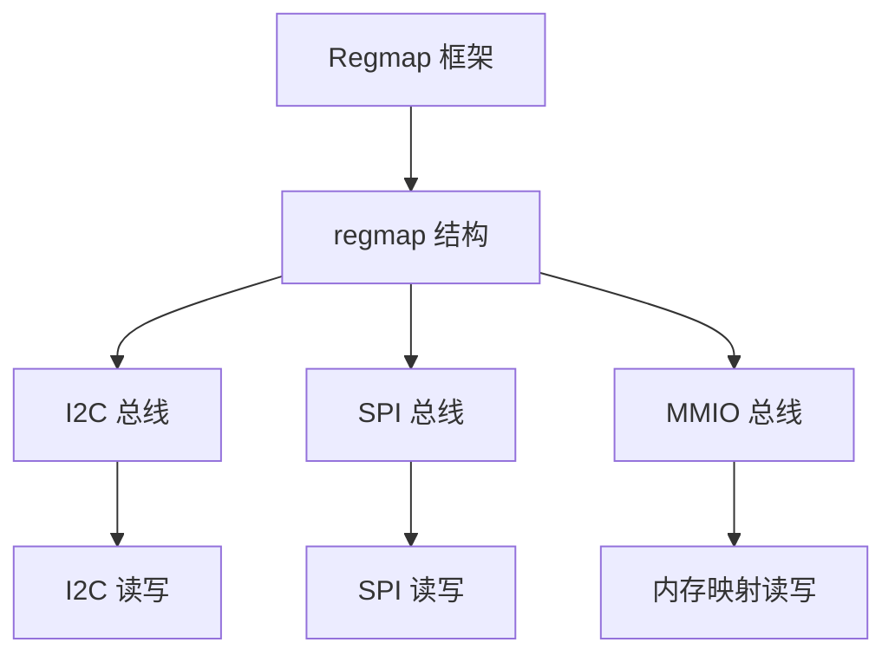

# Regmap 框架 - 架构图

```mermaid
graph TD
    A["Regmap 框架"] --> B["regmap 结构"]
    B --> C["I2C 总线"]
    B --> D["SPI 总线"]
    B --> E["MMIO 总线"]
    C --> F["I2C 读写"]
    D --> G["SPI 读写"]
    E --> H["内存映射读写"]
```
