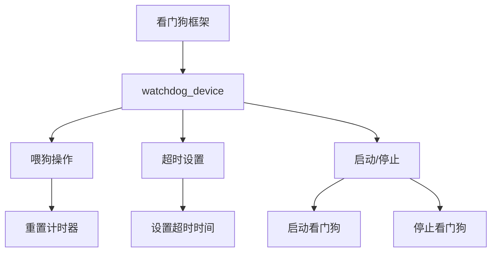

# 看门狗设备 - 架构图

```mermaid
graph TD
    A["看门狗框架"] --> B["watchdog_device"]
    B --> C["喂狗操作"]
    B --> D["超时设置"]
    B --> E["启动/停止"]
    C --> F["重置计时器"]
    D --> G["设置超时时间"]
    E --> H["启动看门狗"]
    E --> I["停止看门狗"]
```
