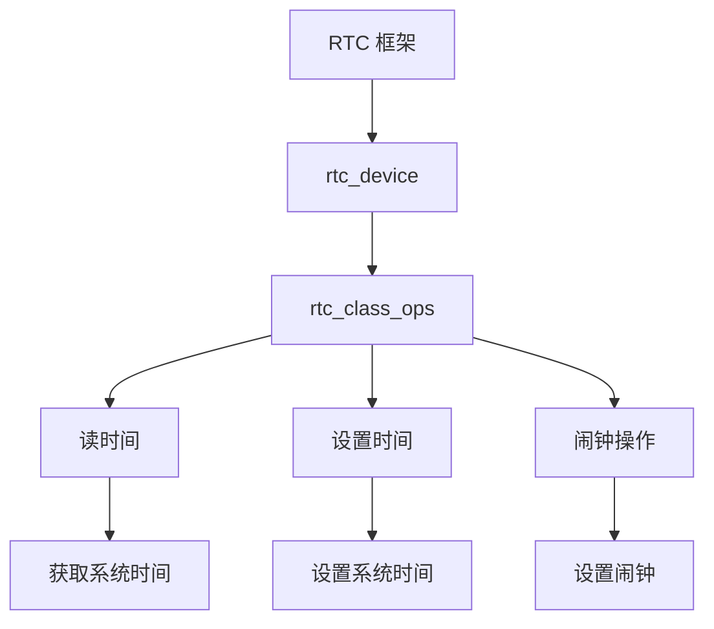

# RTC 实时时钟 - 架构图

```mermaid
graph TD
    A["RTC 框架"] --> B["rtc_device"]
    B --> C["rtc_class_ops"]
    C --> D["读时间"]
    C --> E["设置时间"]
    C --> F["闹钟操作"]
    D --> G["获取系统时间"]
    E --> H["设置系统时间"]
    F --> I["设置闹钟"]
```
