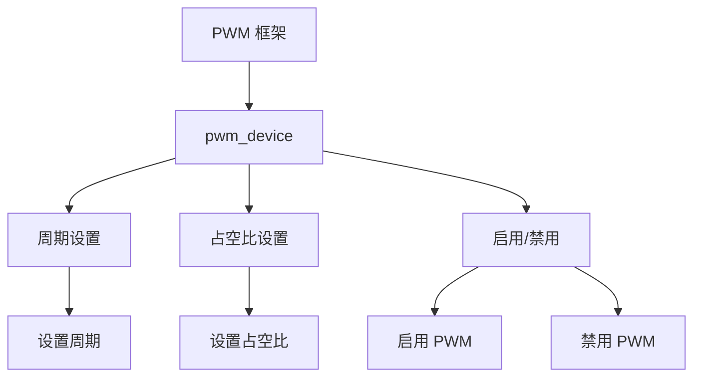

# PWM 控制器 - 架构图

```mermaid
graph TD
    A["PWM 框架"] --> B["pwm_device"]
    B --> C["周期设置"]
    B --> D["占空比设置"]
    B --> E["启用/禁用"]
    C --> F["设置周期"]
    D --> G["设置占空比"]
    E --> H["启用 PWM"]
    E --> I["禁用 PWM"]
```
