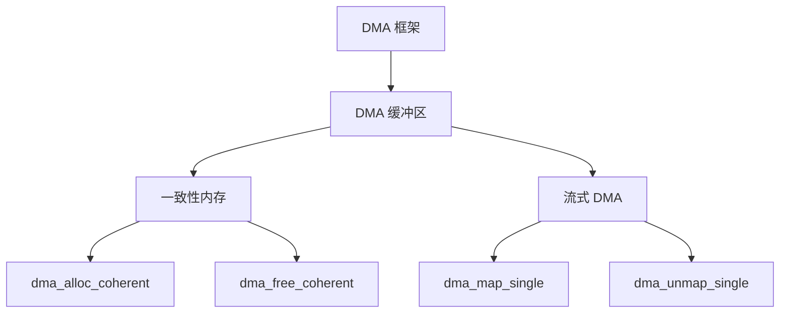

# DMA 内存管理 - 架构图

```mermaid
graph TD
    A["DMA 框架"] --> B["DMA 缓冲区"]
    B --> C["一致性内存"]
    B --> D["流式 DMA"]
    C --> E["dma_alloc_coherent"]
    C --> F["dma_free_coherent"]
    D --> G["dma_map_single"]
    D --> H["dma_unmap_single"]
```
