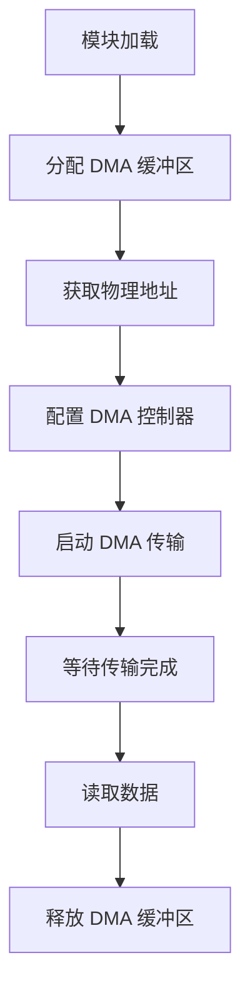

# DMA 内存管理 - 流程图

```mermaid
graph TD
    A["模块加载"] --> B["分配 DMA 缓冲区"]
    B --> C["获取物理地址"]
    C --> D["配置 DMA 控制器"]
    D --> E["启动 DMA 传输"]
    E --> F["等待传输完成"]
    F --> G["读取数据"]
    G --> H["释放 DMA 缓冲区"]
```
