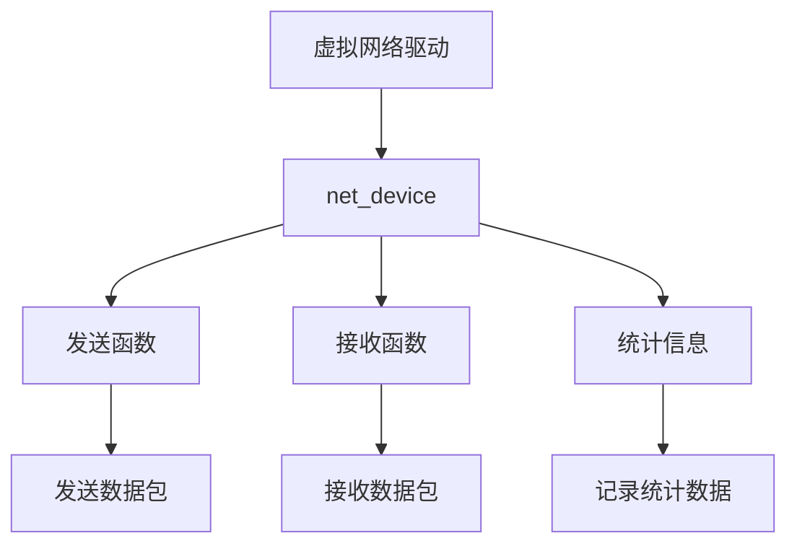

# 虚拟网络接口 - 架构图

```mermaid
graph TD
    A["虚拟网络驱动"] --> B["net_device"]
    B --> C["发送函数"]
    B --> D["接收函数"]
    B --> E["统计信息"]
    C --> F["发送数据包"]
    D --> G["接收数据包"]
    E --> H["记录统计数据"]
```
