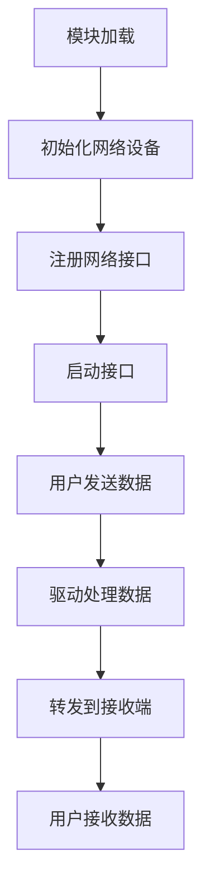

# 虚拟网络接口 - 流程图

```mermaid
graph TD
    A["模块加载"] --> B["初始化网络设备"]
    B --> C["注册网络接口"]
    C --> D["启动接口"]
    D --> E["用户发送数据"]
    E --> F["驱动处理数据"]
    F --> G["转发到接收端"]
    G --> H["用户接收数据"]
```
