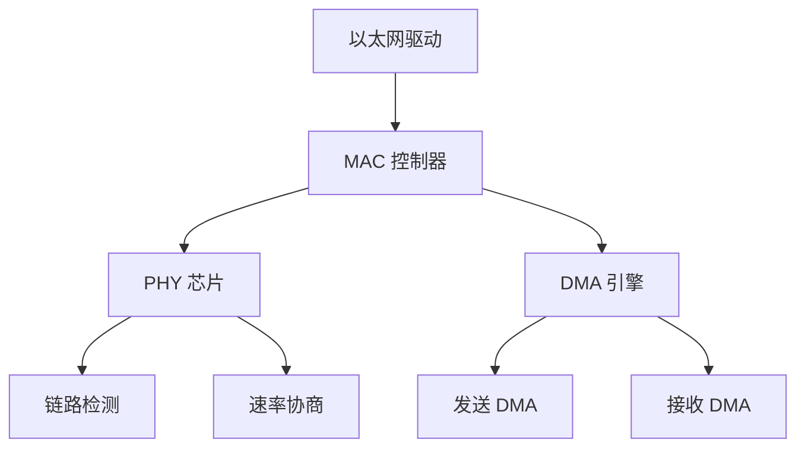

# 以太网 MAC/PHY - 架构图

```mermaid
graph TD
    A["以太网驱动"] --> B["MAC 控制器"]
    B --> C["PHY 芯片"]
    B --> D["DMA 引擎"]
    C --> E["链路检测"]
    C --> F["速率协商"]
    D --> G["发送 DMA"]
    D --> H["接收 DMA"]
```
