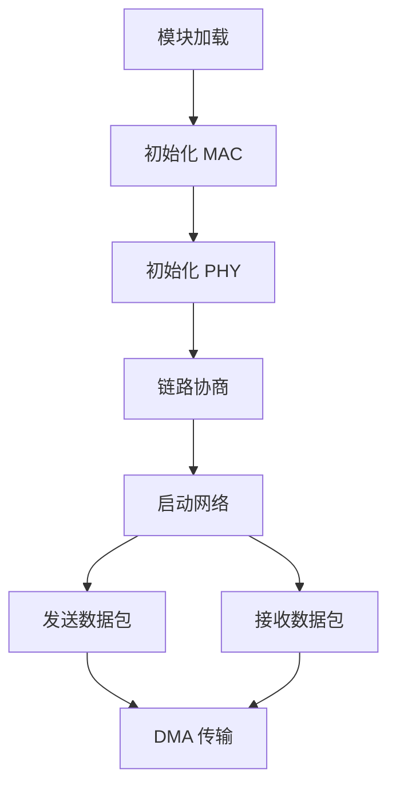

# 以太网 MAC/PHY - 流程图

```mermaid
graph TD
    A["模块加载"] --> B["初始化 MAC"]
    B --> C["初始化 PHY"]
    C --> D["链路协商"]
    D --> E["启动网络"]
    E --> F["发送数据包"]
    E --> G["接收数据包"]
    F --> H["DMA 传输"]
    G --> H
```
