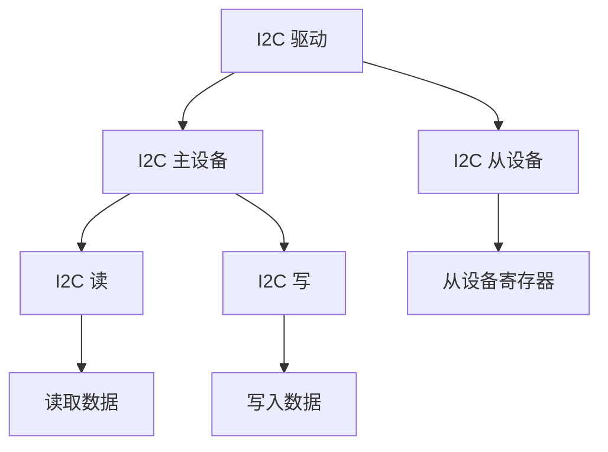

# I2C 总线驱动 - 架构图

```mermaid
graph TD
    A["I2C 驱动"] --> B["I2C 主设备"]
    A --> C["I2C 从设备"]
    B --> D["I2C 读"]
    B --> E["I2C 写"]
    C --> F["从设备寄存器"]
    D --> G["读取数据"]
    E --> H["写入数据"]
```
