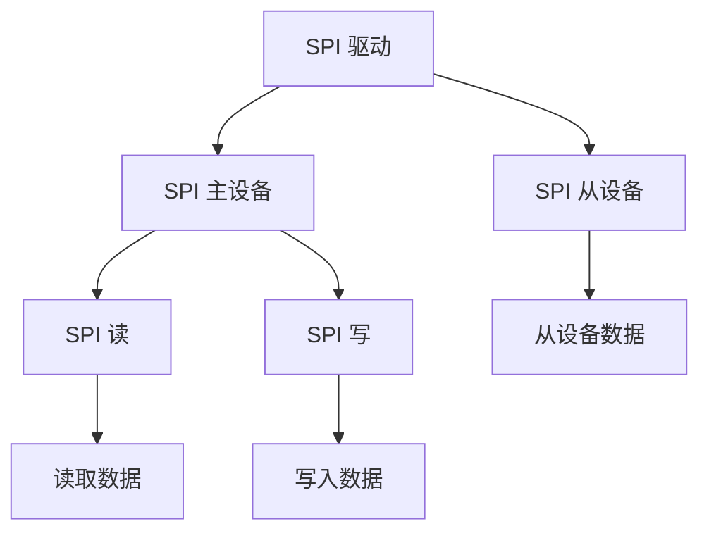

# SPI 总线驱动 - 架构图

```mermaid
graph TD
    A["SPI 驱动"] --> B["SPI 主设备"]
    A --> C["SPI 从设备"]
    B --> D["SPI 读"]
    B --> E["SPI 写"]
    C --> F["从设备数据"]
    D --> G["读取数据"]
    E --> H["写入数据"]
```
