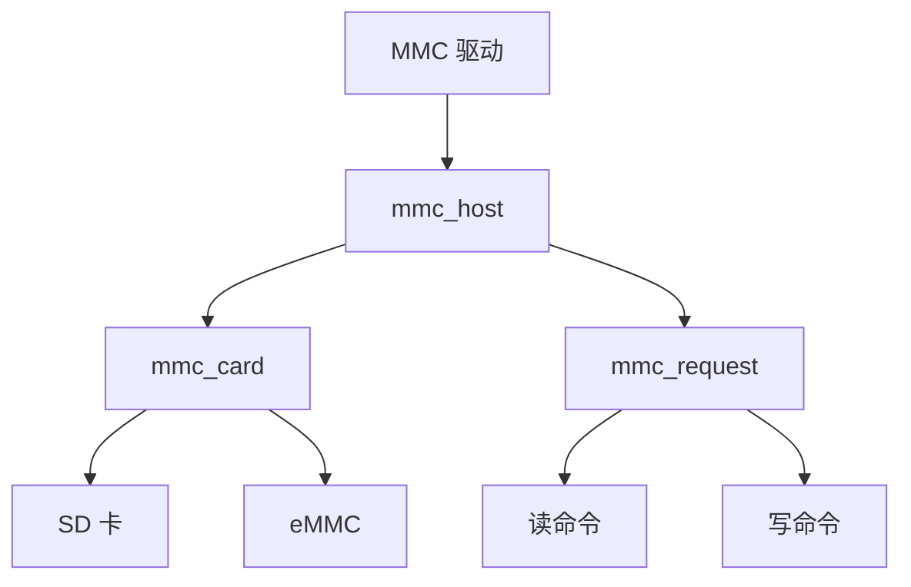

# MMC 卡驱动 - 架构图

```mermaid
graph TD
    A["MMC 驱动"] --> B["mmc_host"]
    B --> C["mmc_card"]
    B --> D["mmc_request"]
    C --> E["SD 卡"]
    C --> F["eMMC"]
    D --> G["读命令"]
    D --> H["写命令"]
```
