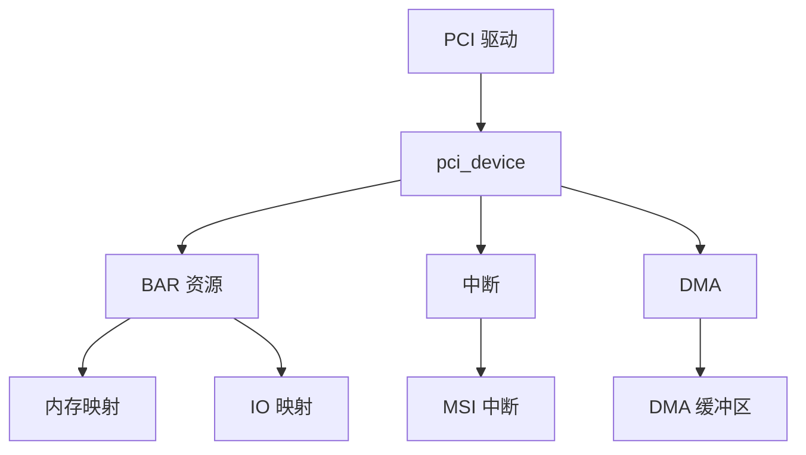

# PCI 总线驱动 - 架构图

```mermaid
graph TD
    A["PCI 驱动"] --> B["pci_device"]
    B --> C["BAR 资源"]
    B --> D["中断"]
    B --> E["DMA"]
    C --> F["内存映射"]
    C --> G["IO 映射"]
    D --> H["MSI 中断"]
    E --> I["DMA 缓冲区"]
```
