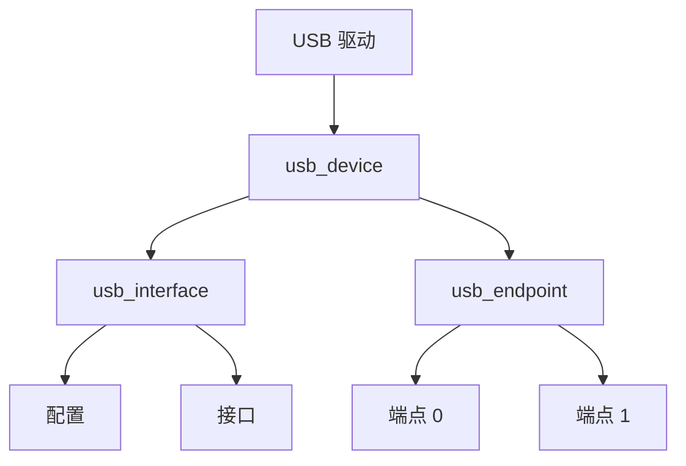

# USB 总线驱动 - 架构图

```mermaid
graph TD
    A["USB 驱动"] --> B["usb_device"]
    B --> C["usb_interface"]
    B --> D["usb_endpoint"]
    C --> E["配置"]
    C --> F["接口"]
    D --> G["端点 0"]
    D --> H["端点 1"]
```
