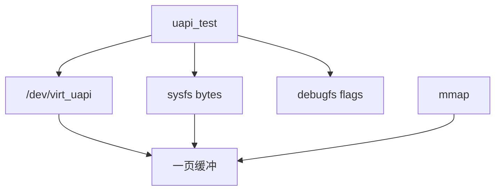

# virt_uapi 结构

```mermaid
graph TD
    app["uapi_test"] --> dev["/dev/virt_uapi"]
    app --> sys["sysfs bytes"]
    app --> dbg["debugfs flags"]
    dev --> page["一页缓冲"]
    sys --> page
    mmap["mmap"] --> page
```

设备节点、sysfs 和 mmap 共用 `struct virt_uapi` 里的那一页。debugfs 只暴露 `flags`，不参与数据路径。
