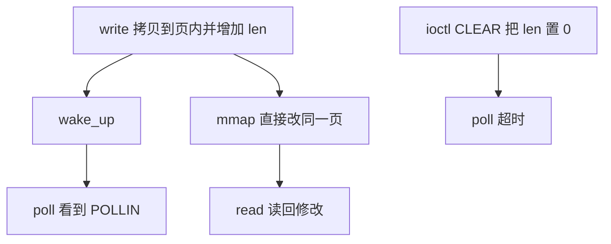

# virt_uapi 路径

```mermaid
graph TD
    w["write 拷贝到页内并增加 len"] --> wake["wake_up"]
    wake --> poll["poll 看到 POLLIN"]
    w --> mmap["mmap 直接改同一页"]
    mmap --> rd["read 读回修改"]
    clr["ioctl CLEAR 把 len 置 0"] --> idle["poll 超时"]
```
