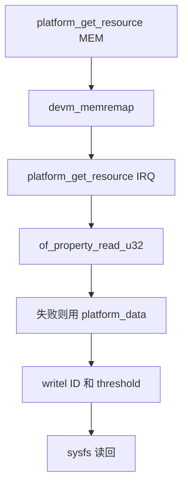

# probe 读取顺序

```mermaid
graph TD
    a["platform_get_resource MEM"] --> b["devm_memremap"]
    b --> c["platform_get_resource IRQ"]
    c --> d["of_property_read_u32"]
    d --> e["失败则用 platform_data"]
    e --> f["writel ID 和 threshold"]
    f --> g["sysfs 读回"]
```
