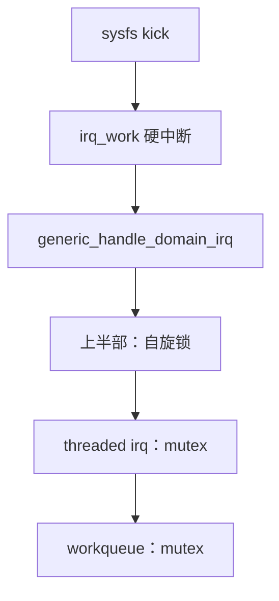

# 上半部、线程、工作队列

```mermaid
graph TD
    kick["sysfs kick"] --> iw["irq_work 硬中断"]
    iw --> gh["generic_handle_domain_irq"]
    gh --> hard["上半部：自旋锁"]
    hard --> th["threaded irq：mutex"]
    th --> wq["workqueue：mutex"]
```
