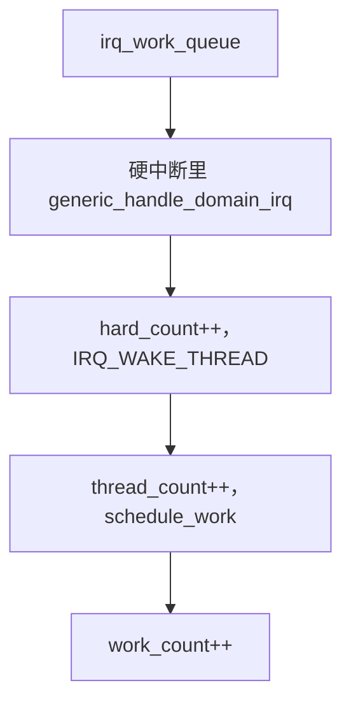

# kick 之后

```mermaid
graph TD
    a["irq_work_queue"] --> b["硬中断里 generic_handle_domain_irq"]
    b --> c["hard_count++，IRQ_WAKE_THREAD"]
    c --> d["thread_count++，schedule_work"]
    d --> e["work_count++"]
```
