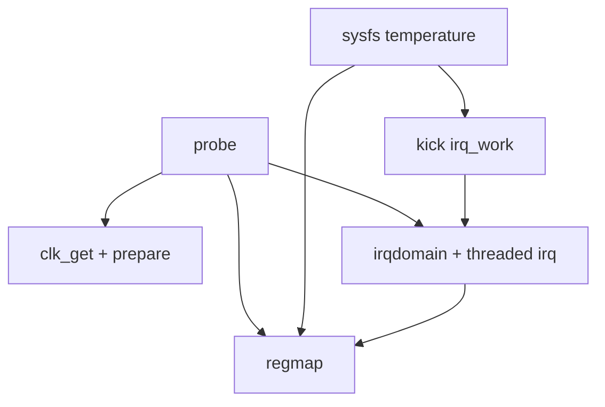

# probe 里的三块

```mermaid
graph TD
    p["probe"] --> r["regmap"]
    p --> c["clk_get + prepare"]
    p --> i["irqdomain + threaded irq"]
    s["sysfs temperature"] --> r
    s --> k["kick irq_work"]
    k --> i
    i --> r
```
