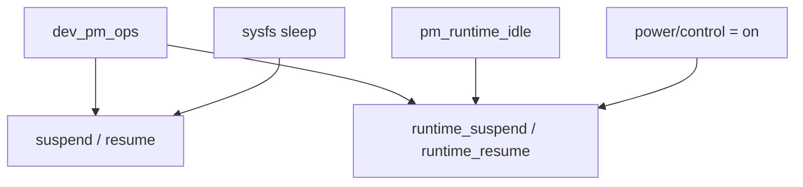

# 两套电源回调

```mermaid
graph TD
    ops["dev_pm_ops"] --> sys["suspend / resume"]
    ops --> rt["runtime_suspend / runtime_resume"]
    sleep["sysfs sleep"] --> sys
    idle["pm_runtime_idle"] --> rt
    on["power/control = on"] --> rt
```
