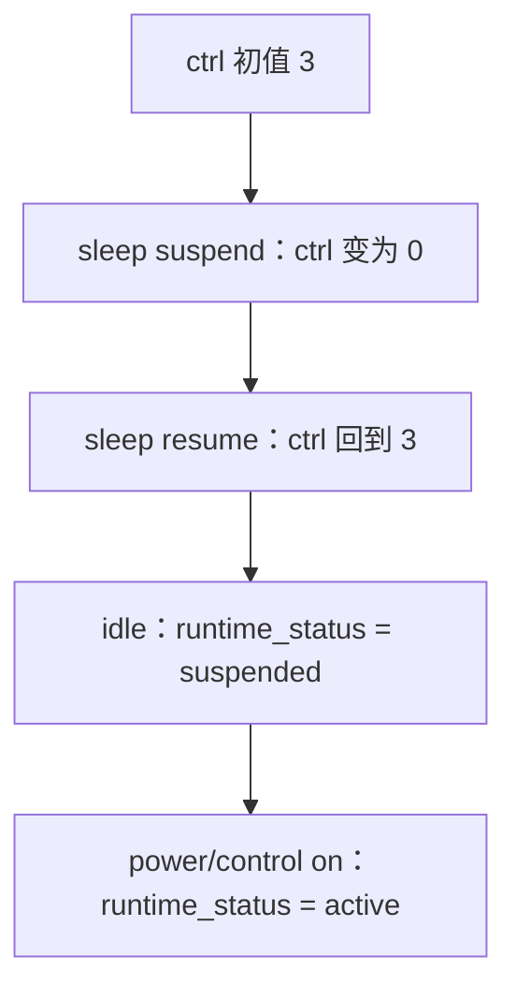

# 实验顺序

```mermaid
graph TD
    a["ctrl 初值 3"] --> b["sleep suspend：ctrl 变为 0"]
    b --> c["sleep resume：ctrl 回到 3"]
    c --> d["idle：runtime_status = suspended"]
    d --> e["power/control on：runtime_status = active"]
```
