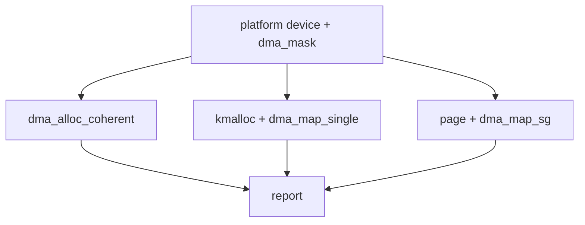

# 三种映射

```mermaid
graph TD
    dev["platform device + dma_mask"] --> c["dma_alloc_coherent"]
    dev --> s["kmalloc + dma_map_single"]
    dev --> g["page + dma_map_sg"]
    c --> r["report"]
    s --> r
    g --> r
```
