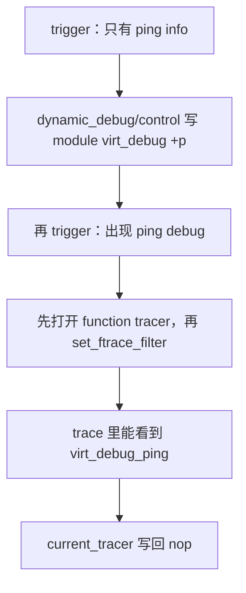

# 打开一条 pr_debug

```mermaid
graph TD
    a["trigger：只有 ping info"] --> b["dynamic_debug/control 写 module virt_debug +p"]
    b --> c["再 trigger：出现 ping debug"]
    c --> d["先打开 function tracer，再 set_ftrace_filter"]
    d --> e["trace 里能看到 virt_debug_ping"]
    e --> f["current_tracer 写回 nop"]
```
